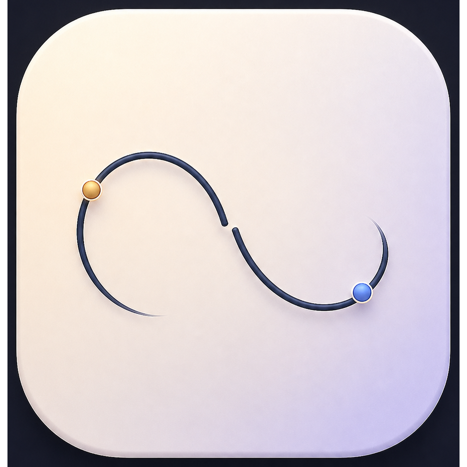

# Life Moment

<p align="center">
  
</p>

一个常驻 macOS 菜单栏的轻量时间管理工具：左键点击菜单栏图标，popover 从图标下方弹出；失焦自动隐藏；不占 Dock、不打扰工作流。

## 特性

- **菜单栏 popover**：左键弹出 / 收起，点击外部自动隐藏（失焦 500ms 后生效），右键显示系统菜单
- **生活倒计时**：正计时 / 倒计时、自定义图标与主题色、编辑弹窗支持竖向滚动
- **学术 DDL**：内置 100+ CCF 会议截止日期，支持收藏、筛选、时间线视图
- **人生进度**：可视化人生百分比卡片
- **加密同步**：PBKDF2 + AES-GCM 导出 `.lmsync`，通过 iCloud Drive 手动跨端同步
- **导入回滚**：导入前自动生成本地快照，出错一键撤销
- **原生体验**：不占 Dock、无边框、基于 Tauri 2 WebView 渲染、Framer Motion 动画

## 技术栈

- **后端**：Tauri 2 + Rust（`tauri-plugin-positioner` 处理菜单栏定位）
- **前端**：React 18 + TypeScript + Tailwind CSS + Framer Motion
- **构建**：Vite 6 + `@tauri-apps/cli`

## 快速开始

```bash
npm ci
npm run tauri dev       # 开发模式
npm run tauri build     # 打包 .app / .dmg
```

打包产物：

- `src-tauri/target/release/bundle/macos/Life Moment.app`
- `src-tauri/target/release/bundle/dmg/Life Moment_<version>_aarch64.dmg`

本地安装：

```bash
cp -R "src-tauri/target/release/bundle/macos/Life Moment.app" /Applications/
xattr -cr "/Applications/Life Moment.app"
open "/Applications/Life Moment.app"
```

## 使用说明

| 操作 | 行为 |
|------|------|
| 菜单栏图标 左键 | 弹出 / 收起 popover |
| 菜单栏图标 右键 | 显示 `显示主窗口 / 退出` 菜单 |
| 点击 popover 外部 | 自动隐藏（失焦 500ms 后生效） |
| 卡片点击 | 编辑事件（表单弹框支持滚动） |

## 发布流程

1. 更新三处版本号：
   - `package.json`
   - `src-tauri/Cargo.toml`
   - `src-tauri/tauri.conf.json`
2. 打 tag 并推送：
   ```bash
   git tag app-v0.x.0
   git push origin app-v0.x.0
   ```
3. GitHub Actions 自动构建 macOS 双架构（aarch64 + x86_64）并创建 Draft Release
4. 审核后发布；应用内 Updater 插件自动拉取 `latest.json`

## 自动更新

应用内置 Tauri Updater：

- 私钥：`src-tauri/keys/updater.key`（**不可提交**）
- 公钥：`src-tauri/tauri.conf.json` 中的 `plugins.updater.pubkey`
- GitHub Actions Secrets：
  - `TAURI_SIGNING_PRIVATE_KEY`
  - `TAURI_SIGNING_PRIVATE_KEY_PASSWORD`（无密码留空）

## iOS 支持

仓库已生成 Tauri iOS 原生工程骨架：`src-tauri/gen/apple/life-moment.xcodeproj`。
要装上真机，需在本机安装完整 Xcode、登录 Apple ID、选择 Team 后运行。

## 数据与安全

- 数据默认保存在本地（`AppStateV2`，旧版 `localStorage` 会自动迁移）
- 同步文件只保存密文，不保存口令
- 导入有严格字段校验，异常结构直接拒绝
- 会议官网跳转限定白名单中的 HTTPS 域名
- 已配置 CSP；未使用 `shell` 插件
- macOS 构建为未签名本地分发，不走 App Store / TestFlight

## 目录结构

```
life-moment/
├── src/                  # React 源码
│   ├── components/       # UI 组件
│   ├── hooks/            # 业务逻辑
│   └── lib/              # 工具函数、同步模块
├── src-tauri/            # Rust / Tauri 配置与源码
│   ├── src/main.rs       # 菜单栏 & popover 逻辑
│   └── icons/            # 图标（含 tray-icon.png）
├── public/               # 静态资源
└── package.json
```

## License

MIT
